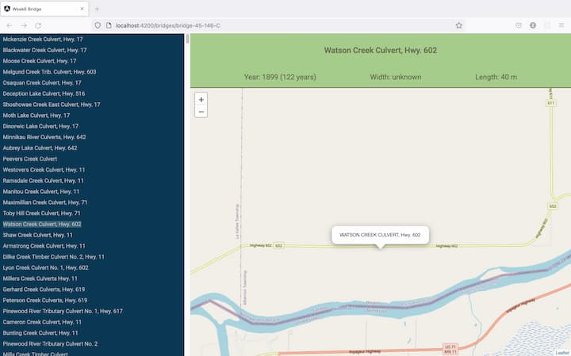
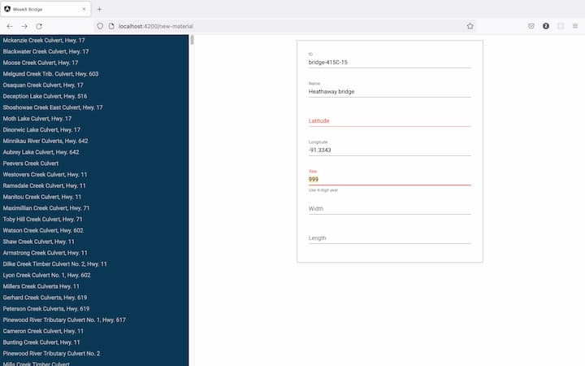

# Bridge Information App

This project is to display Ontario bridge information populated from https//data.ontario/dataset/bridge-conditions

### Bridge Information Pane

### Material UI Angular Form

Various Angular form practice: bridge-form-template-driven, bridge-form-reactive, bridge-form-material components.

## Run the app

Run `ng serve` for a dev server. Navigate to `http://localhost:4200/`. The app will automatically reload if you change any of the source files. 

<b>[Routes] </b>
`bridges/:id`: Display a bridge location, width, length and age for a selected ID 
`bridges`: Display a list of bridges on the left pane and default location of the map which is Ontario 
`new-template`: Angular template-driven form to input bridge information 
`new-reactive`: Angular reactive form 
`new-material`: Angular form with material UI 

## Build

Run `ng build` to build the project. The build artifacts will be stored in the `dist/` directory.

## Running unit tests 

### Test frameworks
Jest: `npm install --save-dev jest` 
Supertest: `npm install --save-dev supertest` 
`npm run test:watch` will run an automatic test when there is a change in the file. 

*Refer to bridge-api/db.test.js file for Jest test.

Jasmine: `npm install --save-dev jasmine` 
RUN Jasmine: `npm test` (ng test)

*Refer to src/app/bridge-info-panel.component.spec.ts for Jasmine test.

